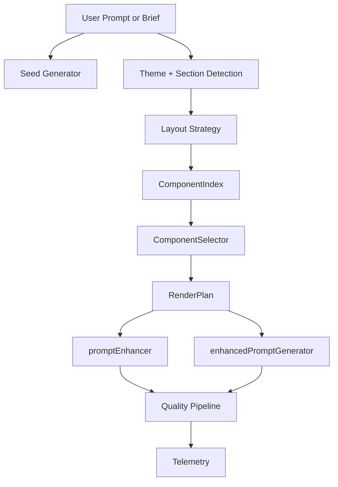

# Design Document: Component Fidelity Pipeline

## Overview

This document describes the design for a component-first fidelity pipeline. The pipeline selects approved components from Shadcn + MagicUI, builds a RenderPlan, and uses that plan to generate prompts via promptEnhancer and enhancedPromptGenerator. The design enforces frontend-only guardrails, normalizes style tokens, and guarantees diversity by default.

## Architecture



## Data Models

```ts
export type ComponentIndexEntry = {
  id: string;
  sectionType: string;
  source: 'shadcn' | 'magicui';
  propsContract: string[];
  visualTags: string[];
  styleTags: string[];
  layoutArchetype: string;
  dependencies: string[];
};

export type RenderPlanSection = {
  sectionType: string;
  componentId: string;
  propsContract: string[];
  layoutVariant: string;
  styleTokens: {
    typography: string;
    spacing: string;
    radius: string;
    colors: string[];
  };
};

export type RenderPlan = {
  seed: number;
  layoutUniquenessHash: string;
  sections: RenderPlanSection[];
};
```

## Selection Policy

1. Filter by sectionType and required props coverage.
2. Score by keyword match, visual/style tag match, style compatibility, and section affinity.
3. Select from Top-K candidates (K >= 3) using the current seed.
4. Apply a recency penalty to recently used component ids.

## Diversity Strategy

- Each run uses a new seed by default.
- LayoutUniquenessHash is computed from section order, layout archetype, and selected component ids.
- If a hash matches a recent run, regenerate with a new seed up to 2 times.

## Guardrails

- Frontend-only guardrail added to prompts.
- Forbidden dependencies are excluded by the selector.
- Components that cannot accept normalized tokens are excluded.

## Telemetry

Record and aggregate:
- componentMatchRate
- fallbackRate
- repeatPenaltyTriggered
- avgCandidatesPerSection

Expose a summary API for monitoring.

## Error Handling

- If no candidates match, select from a curated fallback pool.
- If dependencies conflict, retry with another candidate in Top-K.
- If RenderPlan still fails, return best-effort plan with warnings.

## Testing Strategy

- Unit tests: selector filters, scoring, allowlist rules.
- Property tests: diversity across repeated runs of the same prompt.
- Contract tests: required props coverage for each section.
- E2E tests: RenderPlan integration into promptEnhancer and enhancedPromptGenerator.
