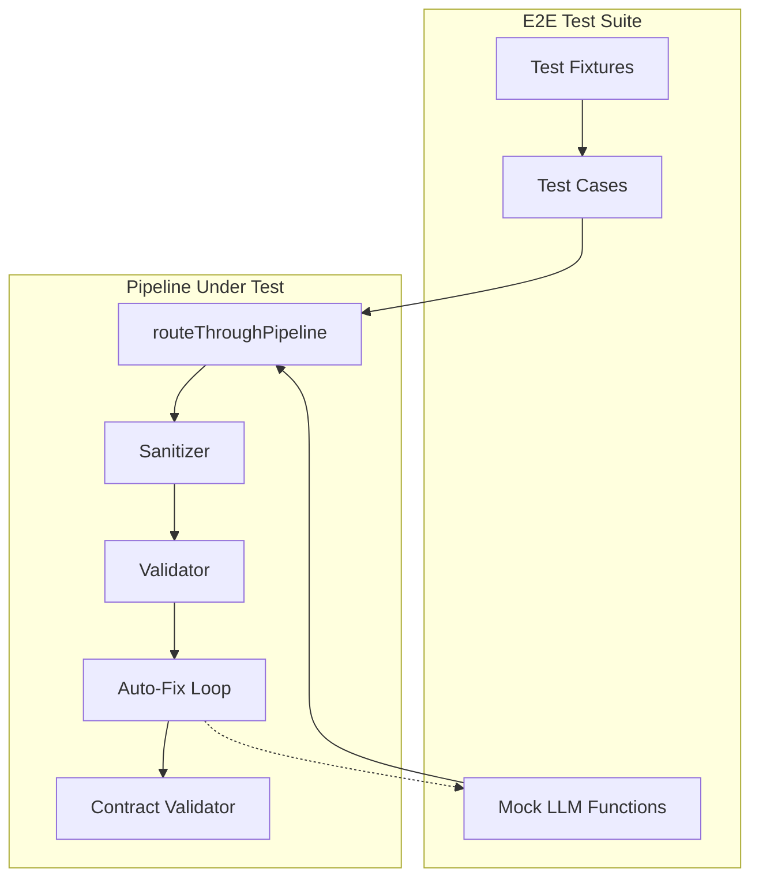

# Design Document: E2E Pipeline Tests

## Overview

This document describes the design for end-to-end integration tests of the Production-Grade Quality Pipeline. The tests validate that all 5 stages (Sanitizer, Validator, Auto-Fix Loop, Contract Validation, Router) work correctly as an integrated system.

The tests use mock LLM functions to ensure determinism and speed while still exercising the full pipeline flow.

## Architecture



## Components and Interfaces

### Mock LLM Functions

```typescript
/**
 * Mock LLM that returns fixed code for specific error patterns.
 * Used to test the LLM repair path deterministically.
 */
type MockLlmRepairFn = (prompt: string) => Promise<string>;

/**
 * Creates a mock that returns valid code on first call.
 */
function createSuccessfulMock(): MockLlmRepairFn;

/**
 * Creates a mock that fails N times then succeeds.
 */
function createRetryMock(failCount: number): MockLlmRepairFn;

/**
 * Creates a mock that always fails (throws or returns invalid code).
 */
function createFailingMock(): MockLlmRepairFn;

/**
 * Creates a mock that records all calls for inspection.
 */
function createRecordingMock(): {
  mock: MockLlmRepairFn;
  calls: string[];
};
```

### Test Fixtures

```typescript
/**
 * Valid TSX code samples for passthrough tests.
 */
const VALID_CODE_SAMPLES = {
  simpleComponent: `export function Button() { return <button>Click</button>; }`,
  heroSection: `export function HeroSection() { return <section><h1>Welcome</h1></section>; }`,
  withProps: `export function Card({ title }: { title: string }) { return <div>{title}</div>; }`,
};

/**
 * Code with sanitizer-fixable issues.
 */
const SANITIZER_FIXABLE = {
  truncatedTag: `export const Button = () => <butt>Click</butt>;`,
  extraWhitespace: `export function  Component() { return <div>Hi</div>; }`,
};

/**
 * Code requiring LLM repair.
 */
const LLM_REPAIR_NEEDED = {
  syntaxError: `export const Button = () = > { return <button>Click</button>; }`,
  unclosedTag: `export function Card() { return <div><span>Text</div>; }`,
  missingBrace: `export function Test() { return <div>Hi</div>`,
};

/**
 * Unfixable code (for failure path tests).
 */
const UNFIXABLE_CODE = {
  gibberish: `asdf qwer zxcv not valid code at all`,
  incomplete: `export function`,
};
```

### Test Categories

1. **Passthrough Tests** - Valid code passes without modification
2. **Sanitizer Path Tests** - Minor issues fixed without LLM
3. **LLM Repair Tests** - Complex issues fixed by mock LLM
4. **Fallback Tests** - Primary fails, fallback succeeds
5. **Failure Tests** - Unfixable code fails gracefully
6. **Contract Tests** - Section-specific validation
7. **Statistics Tests** - Pipeline metrics recording

## Data Models

### PipelineResult (existing)

```typescript
interface PipelineResult {
  success: boolean;
  code: string;
  filename: string;
  stages: {
    sanitizer: { ran: boolean; changed: boolean };
    validator: { ran: boolean; valid: boolean; errors: number };
    contract: { ran: boolean; valid: boolean; score: number };
    autoFix: { ran: boolean; success: boolean; attempts: number };
  };
  finalValidation: ValidationResult;
  contractValidation?: ContractValidationResult;
  warnings: string[];
  processingTimeMs: number;
}
```

### Test Assertion Helpers

```typescript
/**
 * Assert pipeline succeeded with expected stage states.
 */
function assertPipelineSuccess(result: PipelineResult, expected: {
  sanitizerChanged?: boolean;
  autoFixRan?: boolean;
  contractRan?: boolean;
}): void;

/**
 * Assert pipeline failed with expected error information.
 */
function assertPipelineFailure(result: PipelineResult, expected: {
  hasErrors?: boolean;
  hasUnifiedViolations?: boolean;
  hasWarnings?: boolean;
}): void;
```

## Correctness Properties

*A property is a characteristic or behavior that should hold true across all valid executions of a system—essentially, a formal statement about what the system should do. Properties serve as the bridge between human-readable specifications and machine-verifiable correctness guarantees.*

### Property 1: Valid Code Passthrough Invariant

*For any* valid TSX/JSX code, when passed through routeThroughPipeline, the result SHALL have success=true, sanitizer.ran=true, validator.ran=true, and processingTimeMs > 0.

**Validates: Requirements 1.1, 1.2, 1.3, 1.4**

### Property 2: Sanitizer-Fixed Code Success

*For any* code that is fixable by sanitizer alone (truncated tags, minor syntax issues), when passed through routeThroughPipeline without llmRepairFn, the result SHALL have success=true and sanitizer.changed=true.

**Validates: Requirements 2.1, 2.2**

### Property 3: Failure Includes Error Details

*For any* code that fails validation and cannot be fixed, the result SHALL have success=false, finalValidation.errors.length > 0, and unifiedViolations populated with structured error codes.

**Validates: Requirements 5.1, 5.2, 5.3**

### Property 4: Contract Validation Runs When Configured

*For any* code processed with sectionType option set, the result SHALL have contract.ran=true and contractValidation object populated with score and violations.

**Validates: Requirements 6.1, 6.4**

### Property 5: LLM Repair Validates Output

*For any* LLM repair attempt, the repaired code SHALL be validated before being accepted. If validation fails, another attempt SHALL be made (up to MAX_FIX_ATTEMPTS).

**Validates: Requirements 3.2**

## Error Handling

### Mock LLM Errors

- Mock throws exception → Catch, log, try next attempt
- Mock returns empty string → Treat as invalid, try next attempt
- Mock returns non-code response → extractCodeFromResponse handles gracefully

### Pipeline Errors

- Sanitizer throws → Log error, continue with original code
- Validator throws → Return failure with error details
- Contract validator throws → Log warning, skip contract validation

### Test Isolation

- Each test resets pipeline statistics via `resetPipelineStats()`
- Mocks are created fresh for each test
- No shared state between tests

## Testing Strategy

### Unit Tests vs Property Tests

This spec focuses on **integration tests** that exercise the full pipeline. The individual stages (sanitizer, validator, etc.) already have comprehensive unit tests.

**Unit tests** (existing):
- `codeSanitizer.spec.ts` - 41 tests
- `codeValidator.spec.ts` - 16 tests
- `autoFixLoop.spec.ts` - 25 tests
- `sectionContracts.spec.ts` - 41 tests
- `generationRouter.spec.ts` - 31 tests

**E2E integration tests** (this spec):
- Test full pipeline flow with mock LLM
- Verify stage interactions
- Test edge cases across stage boundaries

### Property-Based Testing

Property tests will use **fast-check** library (already used in the project) with minimum 100 iterations per property.

```typescript
import * as fc from 'fast-check';

// Example: Valid code passthrough property
fc.assert(
  fc.property(
    validTsxCodeArbitrary,
    async (code) => {
      const result = await routeThroughPipeline(code, 'Test.tsx');
      return result.success === true && result.stages.sanitizer.ran === true;
    }
  ),
  { numRuns: 100 }
);
```

### Test File Structure

```
Projects/bolt.diy/app/lib/services/
├── generationRouter.spec.ts      # Existing unit tests
├── generationRouter.e2e.spec.ts  # New E2E tests (this spec)
```

### Test Tagging

Each property test will be tagged with:
```typescript
// Feature: e2e-pipeline-tests, Property 1: Valid Code Passthrough Invariant
// Validates: Requirements 1.1, 1.2, 1.3, 1.4
```
