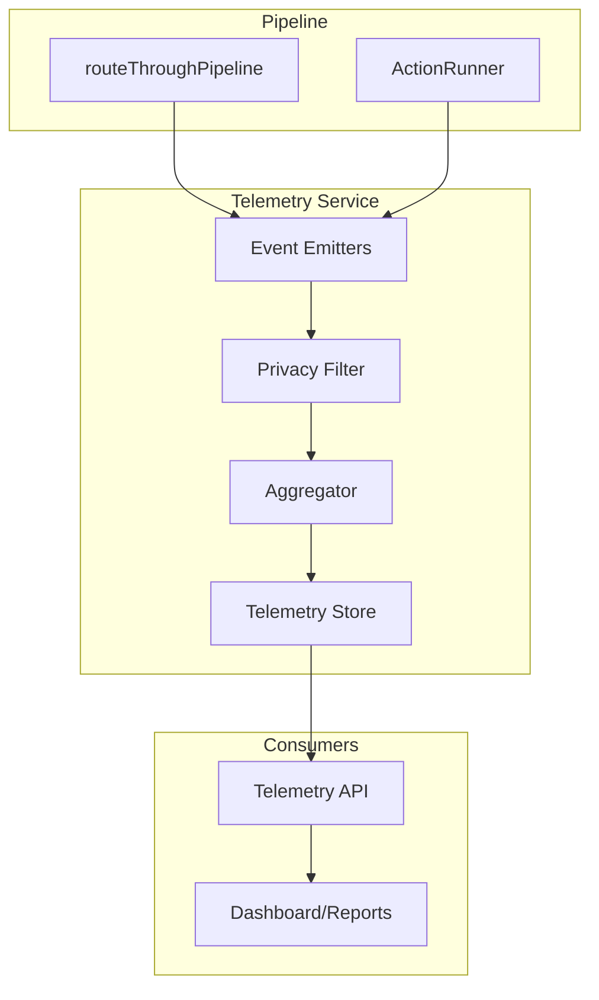

# Design Document: Pipeline Telemetry

## Overview

This document describes the design for a telemetry system that collects anonymized metrics from the quality pipeline. The system enables data-driven optimization by tracking ViolationCode frequencies, auto-fix success rates, timing breakdowns, and quarantine patterns.

## Architecture



## Components and Interfaces

### Telemetry Event Types

```typescript
/**
 * Event emitted after each pipeline run.
 */
interface PipelineRunEvent {
  timestamp: string; // ISO 8601
  
  // File context (anonymized)
  fileExt: string; // .tsx, .css, .json
  sectionType?: string; // hero, pricing, etc.
  
  // Outcome
  success: boolean;
  usedFallback: boolean;
  quarantined: boolean;
  
  // Violation breakdown (codes only, no messages)
  violationCounts: {
    errors: number;
    warnings: number;
    byCode: Record<string, number>; // ViolationCode -> count
  };
  
  // Auto-fix stats
  autoFix: {
    ran: boolean;
    success: boolean;
    attempts: number;
  };
  
  // Timing breakdown (ms)
  timings: {
    sanitizer: number;
    validator: number;
    contract: number;
    autoFix: number;
    total: number;
  };
}

/**
 * Event emitted when a file is quarantined.
 */
interface QuarantineEvent {
  timestamp: string;
  fileExt: string;
  violationCodes: string[]; // ViolationCode[]
  sanitizerWarningCodes: string[];
  riskLevel: 'low' | 'medium' | 'high';
  autoFixAttempts: number;
}

/**
 * Event emitted after prompt enhancement for design quality.
 */
interface DesignQualityEvent {
  timestamp: string;
  theme?: string;
  stylePackId: string;
  designQualityScore: number;
  designCuesCoverage: {
    typography: boolean;
    layout: boolean;
    visualHierarchy: boolean;
    motion: boolean;
  };
  layoutUniquenessHash: string;
}
```

### Telemetry Store

```typescript
/**
 * In-memory telemetry storage with aggregation.
 */
interface TelemetryStore {
  // Counters
  totalRuns: number;
  successCount: number;
  failureCount: number;
  quarantineCount: number;
  fallbackUsedCount: number;

  // Design quality tracking
  designQualityRuns: number;
  designQualityTotal: number;
  designStylePackCounts: Map<string, number>;
  layoutUniquenessHashes: Set<string>;
  
  // ViolationCode tracking
  violationFrequency: Map<string, number>;
  violationQuarantineRate: Map<string, { total: number; quarantined: number }>;
  
  // Auto-fix tracking
  autoFixByCode: Map<string, { attempts: number; successes: number }>;
  
  // Timing aggregates
  timingTotals: {
    sanitizer: number;
    validator: number;
    contract: number;
    autoFix: number;
    total: number;
  };
  
  // Recent events (ring buffer, last N)
  recentEvents: PipelineRunEvent[];
  recentDesignEvents: DesignQualityEvent[];
}
```

### Telemetry API

```typescript
/**
 * Get aggregated telemetry summary.
 */
function getTelemetrySummary(): TelemetrySummary;

interface TelemetrySummary {
  totalRuns: number;
  successRate: number;
  quarantineRate: number;
  fallbackRate: number;
  avgTimings: {
    sanitizer: number;
    validator: number;
    contract: number;
    autoFix: number;
    total: number;
  };
  autoFixSuccessRate: number;
}

/**
 * Get aggregated design quality summary.
 */
function getDesignQualityStats(): DesignQualityStats;

interface DesignQualityStats {
  totalRuns: number;
  avgDesignQualityScore: number;
  uniquenessRate: number; // unique layout hashes / total runs
  topStylePacks: { id: string; count: number }[];
  designCuesCoverageRate: {
    typography: number;
    layout: number;
    visualHierarchy: number;
    motion: number;
  };
}

/**
 * Get top N violations by frequency.
 */
function getTopViolations(n: number): ViolationStats[];

interface ViolationStats {
  code: string;
  count: number;
  percentage: number;
  quarantineRate: number;
  autoFixSuccessRate: number;
}

/**
 * Get quarantine analysis.
 */
function getQuarantineStats(): QuarantineStats;

interface QuarantineStats {
  total: number;
  byRiskLevel: Record<string, number>;
  topViolationCodes: string[];
  avgAutoFixAttempts: number;
}

/**
 * Reset telemetry (for testing).
 */
function resetTelemetry(): void;
```

## Data Models

### Privacy Filter Rules

```typescript
/**
 * Fields that are ALLOWED in telemetry:
 */
const ALLOWED_FIELDS = [
  'timestamp',
  'fileExt',        // .tsx, .css (not full path)
  'sectionType',    // hero, pricing
  'success',
  'usedFallback',
  'quarantined',
  'violationCodes', // SYNTAX_*, CONTRACT_* (codes only)
  'counts',         // numeric counts
  'timings',        // ms values
  'riskLevel',      // low/medium/high
  'attempts',       // numeric
  'stylePackId',
  'designQualityScore',
  'designCuesCoverage',
  'layoutUniquenessHash',
];

/**
 * Fields that are FORBIDDEN in telemetry:
 */
const FORBIDDEN_FIELDS = [
  'code',           // actual source code
  'content',        // file content
  'prompt',         // LLM prompts
  'message',        // error messages (may contain code)
  'filePath',       // full paths
  'context.snippet', // code snippets
];
```

## Correctness Properties

*A property is a characteristic or behavior that should hold true across all valid executions of a system.*

### Property 1: Privacy Invariant

*For any* telemetry event emitted, the event SHALL NOT contain code content, full file paths, prompts, or diagnostic messages that may contain code snippets.

**Validates: Requirements 3.1, 3.2, 3.3, 3.4**

### Property 2: Event Completeness

*For any* pipeline run that completes (success or failure), exactly one pipeline_run event SHALL be emitted with all required fields populated.

**Validates: Requirements 1.1, 1.2, 1.3, 1.4, 1.5**

### Property 3: Aggregation Consistency

*For any* sequence of N pipeline runs, getTelemetrySummary().totalRuns SHALL equal N, and successRate SHALL equal successCount/totalRuns.

**Validates: Requirements 4.1**

### Property 4: ViolationCode Tracking Accuracy

*For any* ViolationCode that appears in pipeline runs, getTopViolations() SHALL return accurate frequency counts matching the sum of occurrences across all events.

**Validates: Requirements 4.2, 4.3**

### Property 5: Design quality aggregation

*For any* design_quality events emitted, getDesignQualityStats() SHALL report totalRuns equal to the number of events, and avgDesignQualityScore equal to total score / runs.

**Validates: Requirements 7.1, 7.2, 7.3, 7.4**

## Error Handling

### Telemetry Failures

- Telemetry errors SHALL NOT affect pipeline execution
- If event emission fails, log warning and continue
- If aggregation fails, reset affected counters

### Invalid Events

- Events missing required fields → reject with warning
- Events with forbidden fields → strip fields, emit warning
- Malformed timestamps → use current time

## Testing Strategy

### Unit Tests

- Privacy filter correctly strips forbidden fields
- Aggregator correctly updates counters
- API returns accurate summaries

### Property Tests

- Privacy invariant holds for all generated events
- Aggregation consistency across random event sequences
- ViolationCode tracking accuracy

### Integration Tests

- Pipeline emits events automatically
- ActionRunner emits quarantine events
- End-to-end flow from pipeline to API

