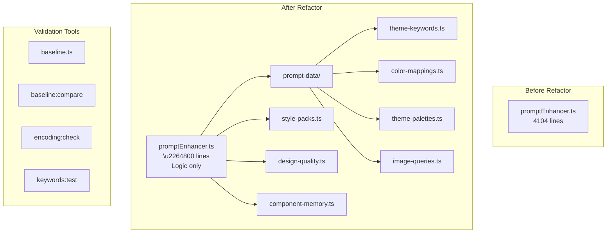

# Design Document: Prompt Enhancer Refactor

## Overview

\u0420\u0435\u0444\u0430\u043a\u0442\u043e\u0440\u0438\u043d\u0433 \u043c\u043e\u0434\u0443\u043b\u044f `promptEnhancer.ts` \u0434\u043b\u044f \u0432\u043e\u0441\u0441\u0442\u0430\u043d\u043e\u0432\u043b\u0435\u043d\u0438\u044f \u0440\u0430\u0431\u043e\u0442\u043e\u0441\u043f\u043e\u0441\u043e\u0431\u043d\u043e\u0441\u0442\u0438 \u0440\u0443\u0441\u0441\u043a\u043e\u044f\u0437\u044b\u0447\u043d\u044b\u0445 \u043f\u0440\u043e\u043c\u043f\u0442\u043e\u0432 \u0438 \u0443\u043b\u0443\u0447\u0448\u0435\u043d\u0438\u044f maintainability. \u0422\u0435\u043a\u0443\u0449\u0438\u0439 \u043c\u043e\u043d\u043e\u043b\u0438\u0442 (~4104 \u0441\u0442\u0440\u043e\u043a) \u0431\u0443\u0434\u0435\u0442 \u0440\u0430\u0437\u0434\u0435\u043b\u0435\u043d \u043d\u0430 \u043c\u043e\u0434\u0443\u043b\u0438 \u0434\u0430\u043d\u043d\u044b\u0445 \u0438 \u043b\u043e\u0433\u0438\u043a\u0438 \u0441 \u0434\u043e\u0431\u0430\u0432\u043b\u0435\u043d\u0438\u0435\u043c \u0438\u043d\u0441\u0442\u0440\u0443\u043c\u0435\u043d\u0442\u043e\u0432 \u0432\u0430\u043b\u0438\u0434\u0430\u0446\u0438\u0438 \u0438 regression testing.

## Current State Analysis

**Existing Implementation vs Spec Gaps:**

| Aspect | Current State | Spec Requirement | Action |
|--------|---------------|------------------|--------|
| Prompt count | 20 (10 EN + 10 RU) | 25 (15 EN + 10 RU) | Add 5 EN prompts |
| Cold import time | Not measured | Median of 5 runs (separate processes) | Implement in baseline.ts |
| Bundle size | Not measured | fs.statSync | Implement in baseline.ts |
| Baseline compare | Strict equality | Structural invariants + tiers | Refactor compare logic |
| Encoding check | U+FFFD, BOM, control chars | + mojibake patterns | Add pattern detection |
| Encoding check scope | app/lib/services only | + scripts/, .kiro/specs/ | Expand scope |
| component-aliases.json | componentKeywords has mojibake | Clean UTF-8 | Fix encoding |
| promptEnhancer.ts | THEME_KEYWORDS_RU clean | Verify | Verified clean |
| Math.random usages | 4 places (lines 1548, 1558, 3199, 3360) | All seeded | Add seed to all |

**Math.random locations in promptEnhancer.ts:**
- Line 1548: `const randomSeed = Math.floor(Math.random() * 1000000) + Date.now();`
- Line 1558: `const j = Math.floor(Math.random() * (i + 1));` (shuffle)
- Line 3199: `const variationSeed = Math.random().toString(36).slice(2, 8);`
- Line 3360: `const pickRandom = <T>(arr: T[]): T => arr[Math.floor(Math.random() * arr.length)];`

## Architecture



## Components and Interfaces

### 1. Baseline System

**Current Implementation** (`scripts/baseline.ts`):
- Uses `withDeterminism()` for seeded random
- Writes to `baseline-results.json` and `baseline-metrics.json`
- Uses `normalizeRun()` from `baseline-utils.ts`
- Does NOT measure cold import time or bundle size

**Required Changes:**
- Add cold import measurement (5 runs, take median)
- Add bundle size measurement via `fs.statSync`
- Add 5 more EN prompts to reach 25 total

```typescript
// scripts/baseline.ts - Enhanced interfaces
interface BaselineResult {
  id: string;
  prompt: string;
  language: 'en' | 'ru';
  detectedTheme: string;
  sectionsCount: number;
  outputLength: number;
  hasRequiredKeys: {
    palette: boolean;
    images: boolean;
  };
  hasDesignCues: {
    typography: boolean;
    layout: boolean;
    visualHierarchy: boolean;
    motion: boolean;
  };
  stylePackId: string;
  layoutUniquenessHash: string;
  designQualityScore: number;
  durationMs: number;
}

interface BaselineMetrics {
  coldImportTimeMs: number;      // median \u0438\u0437 5 \u043f\u0440\u043e\u0433\u043e\u043d\u043e\u0432
  bundleSizeBytes: number;       // fs.statSync \u043d\u0430 promptEnhancer.ts
  avgOutputLength: number;
  avgSectionsCount: number;
  avgDurationMs: number;
}

interface BaselineData {
  meta: {
    generatedAt: string;
    seed: number;
    gitCommit<MOJIBAKE_UTF8_D>: string;
    promptsPath: string;
  };
  runs: BaselineResult[];        // 25 \u043f\u0440\u043e\u043c\u043f\u0442\u043e\u0432 (15 EN + 10 RU)
  metrics: BaselineMetrics;
}

// Cold import measurement - MUST use separate processes for accurate measurement
// ESM caches modules, so we need child_process.fork() or execSync() for each run
async function measureColdImport(runs: number = 5): Promise<number> {
  const times: number[] = [];
  for (let i = 0; i < runs; i++) {
    // Use child process to ensure fresh module cache
    const result = execSync(
      'node --loader tsx --eval "const start = performance.now(); await import(\\\\\\'./app/lib/services/promptEnhancer.ts\\\\\\'); console.log(performance.now() - start);"',
      { encoding: 'utf-8' }
    );
    times.push(parseFloat(result.trim()));
  }
  times.sort((a, b) => a - b);
  return times[Math.floor(times.length / 2)]; // median
}
```

**Baseline Compare** (`scripts/baseline-compare.ts`):

Current implementation uses strict equality for:
- `detectedTheme` - exact match
- `sectionOrder` - array equality
- `blockFlags` - shallow object equality
- `colors` - shallow object equality
- `imageCounts` - deep equality

**Required Changes** - Use structural invariants with warning/error tiers:

```typescript
interface ComparisonReport {
  passed: boolean;               // true if no ERRORS (warnings don't fail)
  errors: string[];              // Critical failures - exit code 1
  warnings: string[];            // Non-critical - exit code 0
}

// Exit code logic:
// - errors.length > 0 \u2192 exit 1 (blocks CI)
// - warnings.length > 0, errors.length === 0 \u2192 exit 0 (non-blocking)
// - both empty \u2192 exit 0 (success)

// Comparison rules:
// ERRORS (fail the check, exit 1):
// - detectedTheme mismatch
// - missing required keys (palette, images)
// - sectionsCount differs by >50% (handle baseline=0: if baseline=0 and current>0, warning not error)

// WARNINGS (report but pass, exit 0):
// - sectionOrder changed
// - blockFlags changed
// - colors changed
// - imageCounts changed
// - designQualityScore drop >15% or below 60
// - layoutUniquenessHash drift
// - cold import time +15% OR +50ms absolute (whichever is larger)
// - bundle size +5%
// - output length drift >30% (handle baseline=0: skip comparison if baseline=0)

// Edge case handling:
// - If baseline sectionsCount=0 and current>0: WARNING (new sections added)
// - If baseline outputLength=0: skip length comparison
// - If baseline metrics missing: skip metric comparison with WARNING
```

### 2. Data Modules

```typescript
// prompt-data/theme-keywords.ts
export const THEME_KEYWORDS: Record<string, string[]>;
export const THEME_KEYWORDS_RU: Record<string, string[]>;

// prompt-data/color-mappings.ts
export const COLOR_WORDS_TO_HEX: Record<string, ColorDefinition>;
export const RU_COLOR_WORDS: Record<string, ColorDefinition>;

// prompt-data/theme-palettes.ts
export const THEME_PALETTES: Record<string, ThemePalette>;

// prompt-data/image-queries.ts
export const THEME_IMAGE_QUERIES: Record<string, ImageQuerySet>;
```

```typescript
// prompt-data/style-packs.ts
export const STYLE_PACKS: StylePack[];

// prompt-data/design-quality.ts
export function scoreDesignQuality(signals: DesignQualitySignals): number;

// prompt-data/component-memory.ts
export const COMPONENT_MEMORY: ComponentMemoryEntry[];
```

### 3. Validation Tools

**Encoding Check** (`scripts/encoding-check.ts`):

Current implementation checks:
- \u2705 U+FFFD (replacement character)
- \u2705 BOM markers (0xEF 0xBB 0xBF)
- \u2705 Control chars (0x80-0x9F, 0xA0)

**Missing - Mojibake patterns:**
- \u274c "<MOJIBAKE_QUESTION>" sequences (corrupted Cyrillic)
- \u274c "\u0420<REPLACEMENT_CHAR>" pattern (UTF-8 decoded as Windows-1251)
- \u274c "\xd0\xba\xd1\u20ac\xd0\xb0\xd1" pattern (double-encoded UTF-8)
- \u274c "<MOJIBAKE_UTF8_ALT>" pattern

**Missing - Scope expansion:**
- \u274c `scripts/baseline-prompts.json` (RU prompts)
- \u274c `.kiro/specs/` (spec files with RU text)

```typescript
// scripts/encoding-check.ts - Enhanced patterns and scope
interface EncodingCheckResult {
  file: string;
  valid: boolean;
  errors: EncodingError[];
}

interface EncodingError {
  line: number;
  column: number;
  type: 'replacement_char' | 'bom' | 'control_char' | 'mojibake';
  context: string;  // 10 chars around the issue
  pattern<MOJIBAKE_UTF8_D>: string; // matched mojibake pattern
}

// Mojibake detection patterns
const MOJIBAKE_PATTERNS = [
  /\\<MOJIBAKE_UTF8_D>{3,}/g,                           // "<MOJIBAKE_QUESTION>" sequences
  /\u0420[\u0430-\u044f\u0410-\u042f<REPLACEMENT_CHAR>]/g,                       // "\u0420<REPLACEMENT_CHAR>" pattern
  /\xd0[\xb0-\xff][\xd1][\u20ac-\xbf]/g,                  // Double-encoded UTF-8
  /[\\xC0-\\xDF][\\x80-\\xBF]{2,}/g,      // Overlong UTF-8 sequences
];

// Extended scope - default roots
const DEFAULT_ROOTS = [
  'app/lib/services',
  'scripts',                           // includes baseline-prompts.json
  '.kiro/specs',                       // includes spec files
];

function checkEncoding(roots: string[]): EncodingCheckResult[];
```

**Keywords Test** (`scripts/keywords-test.ts`):

```typescript
interface KeywordsValidation {
  missingRuKeys: string[];      // themes in EN but not in RU
  missingEnKeys: string[];      // themes in RU but not in EN
  duplicates: string[];         // duplicate keywords within arrays
  emptyArrays: string[];        // themes with empty keyword arrays
}

function validateKeywords(): KeywordsValidation;
```

**Circular Dependency Check:**
```bash
# madge config for ESM
npx madge --circular --extensions ts --ts-config tsconfig.json app/lib/services/
```

## Data Models

### Structural Invariants (\u0434\u043b\u044f baseline comparison)
```typescript
// \u0421\u043f\u0438\u0441\u043e\u043a \u043f\u0440\u043e\u0432\u0435\u0440\u044f\u0435\u043c\u044b\u0445 \u0438\u043d\u0432\u0430\u0440\u0438\u0430\u043d\u0442\u043e\u0432
interface StructuralInvariants {
  themeDetected: boolean;        // theme !== 'default' \u0434\u043b\u044f \u0438\u0437\u0432\u0435\u0441\u0442\u043d\u044b\u0445 \u043f\u0440\u043e\u043c\u043f\u0442\u043e\u0432
  themeMatches: boolean;         // theme \u0441\u043e\u0432\u043f\u0430\u0434\u0430\u0435\u0442 \u0441 baseline
  hasRequiredKeys: {
    palette: boolean;            // \u0440\u0435\u0437\u0443\u043b\u044c\u0442\u0430\u0442 \u0441\u043e\u0434\u0435\u0440\u0436\u0438\u0442 palette object
    images: boolean;             // \u0440\u0435\u0437\u0443\u043b\u044c\u0442\u0430\u0442 \u0441\u043e\u0434\u0435\u0440\u0436\u0438\u0442 images object
    designCues: boolean;          // \u0440\u0435\u0437\u0443\u043b\u044c\u0442\u0430\u0442 \u0441\u043e\u0434\u0435\u0440\u0436\u0438\u0442 designCues object
  };
  hasDesignCues: {
    typography: boolean;
    layout: boolean;
    visualHierarchy: boolean;
    motion: boolean;
  };
  sectionsCount: number;         // \u043a\u043e\u043b\u0438\u0447\u0435\u0441\u0442\u0432\u043e \u0441\u0435\u043a\u0446\u0438\u0439 \u0432 \u0432\u044b\u0432\u043e\u0434\u0435
  outputLengthDelta: number;     // \u0440\u0430\u0437\u043d\u0438\u0446\u0430 \u0432 \u0434\u043b\u0438\u043d\u0435 \u0432\u044b\u0432\u043e\u0434\u0430 (%)
  stylePackId?: string;
  layoutUniquenessHash?: string;
  designQualityScore?: number;
}

// Required keys \u0432 \u0440\u0435\u0437\u0443\u043b\u044c\u0442\u0430\u0442\u0435 enhancePrompt
const REQUIRED_RESULT_KEYS = ['theme', 'palette', 'images', 'brandName', 'designCues', 'stylePackId', 'layoutUniquenessHash', 'designQualityScore'] as const;
```

### Design Quality Enrichment

```typescript
interface DesignCues {
  typography: string;        // e.g., "editorial serif scale with bold display"
  layout: string;            // grid, spacing, composition notes
  visualHierarchy: string;   // primary focus, CTA emphasis, contrast hints
  motion: string;            // subtle motion/hover guidance
}

interface StylePack {
  id: string;
  fontPairing: string;
  typeScale: string;
  gridStyle: string;
  spacingScale: string;
  shapeLanguage: string;
  effects: string[];
  motionNotes: string[];
}

interface DesignQualitySignals {
  designCues: DesignCues;
  stylePackId: string;
  layoutUniquenessHash: string;
  designQualityScore: number;
  designQualityReasons: string[];
}
```

**Notes:**
- DesignCues are injected into the enhanced prompt as explicit directives.
- StylePack is selected deterministically using a variant seed and theme.
- layoutUniquenessHash is derived from section order, layout archetype, and key layout choices.
- designQualityScore is a heuristic score derived from cue coverage and layout diversity.

### Component Memory Directives

```typescript
interface ComponentMemoryEntry {
  id: string;
  section: string;
  themes: string[];
  snippet: string; // short directive or identifier
  unsafe?: boolean;
  forbiddenImports?: string[];
}

function pickComponentDirectives(entries: ComponentMemoryEntry[], seed: string): string[];
```

**Notes:**
- Component memory directives are additive; they never override safety rules.
- Selection is deterministic for a given seed and theme.

### ThemePalette
```typescript
interface ThemePalette {
  dark: string;      // HEX color for dark background
  light: string;     // HEX color for light background
  accent: string;    // HEX color for accent
  accentName: string;
  textOnDark: string;
  textOnLight: string;
}
```

### ColorDefinition
```typescript
interface ColorDefinition {
  hex: string;
  type: 'dark' | 'light' | 'accent';
}
```

### ComparisonReport
```typescript
interface ComparisonReport {
  identical: boolean;
  outputDiffs: OutputDiff[];
  metricsDiffs: MetricsDiff[];
  withinTolerance: boolean;
}
```

## Correctness Properties

*A property is a characteristic or behavior that should hold true across all valid executions of a system\u2014essentially, a formal statement about what the system should do. Properties serve as the bridge between human-readable specifications and machine-verifiable correctness guarantees.*

### Property 1: Baseline structural consistency
*For any* set of test prompts, running the baseline script SHALL produce a valid JSON file where each result contains: id, prompt, language, detectedTheme, sectionsCount, outputLength, hasRequiredKeys (palette, images), and durationMs fields with appropriate types.
**Validates: Requirements 1.1, 1.2**

### Property 2: Russian theme detection
*For any* Russian prompt containing a known theme keyword from THEME_KEYWORDS_RU (e.g., "\u043c\u0435\u0431\u0435\u043b\u044c" \u2192 furniture, "\u0442\u0435\u0445\u043d\u043e\u043b\u043e\u0433\u0438\u0438" \u2192 tech, "\u0435\u0434\u0430" \u2192 food), the Prompt_Enhancer SHALL return the corresponding theme without encoding errors.
**Validates: Requirements 2.1, 2.4**

### Property 3: No encoding corruption in data files
*For any* file in prompt-data/, component-aliases.json, or promptEnhancer.ts, the file SHALL NOT contain: replacement character \\uFFFD, BOM markers (0xEF 0xBB 0xBF), or mojibake patterns (sequences like "<MOJIBAKE_QUESTION>", "\u0420<REPLACEMENT_CHAR>", "\xd0\xba\xd1\u20ac\xd0\xb0\xd1", "<MOJIBAKE_UTF8_ALT>").
**Validates: Requirements 2.2, 2.3, 2.5, 2.6**

### Property 4: Data module exports completeness
*For any* data module after split (theme-keywords.ts, color-mappings.ts, theme-palettes.ts, image-queries.ts), the module SHALL export all expected constants with non-empty values and proper TypeScript types.
**Validates: Requirements 3.2**

### Property 5: No circular dependencies
*For any* module graph after split, running `madge --circular --extensions ts --ts-config tsconfig.json app/lib/services/` SHALL report zero circular dependencies.
**Validates: Requirements 3.3**

### Property 6: Data module purity
*For any* import of data modules, the import SHALL NOT execute side effects: no console output, no global object mutations (Object.assign at module level), no network calls, no file system operations.
**Validates: Requirements 3.4, 3.6**

### Property 7: Baseline comparison accuracy
*For any* two baseline runs, the structural comparison SHALL:
- Report ERRORS for: theme mismatch, missing required keys (palette, images), sectionsCount drift >50%
- Report WARNINGS for: sectionOrder changes, colors changes, imageCounts changes, output length drift >30%, designQualityScore drop >15% or below 60, layoutUniquenessHash drift
- Correctly classify identical runs as passing with no errors
**Validates: Requirements 1.5, 1.6, 4.1, 4.2**

### Property 8: Design cues presence
*For any* enhancePrompt output, the result SHALL include designCues (typography, layout, visualHierarchy, motion) and stylePackId.
**Validates: Requirements 7.1, 7.2**

### Property 9: Layout uniqueness hash generation
*For any* enhanced prompt with layout strategy, the result SHALL include layoutUniquenessHash and a non-null designQualityScore.
**Validates: Requirements 8.2, 9.1**

### Property 10: Performance regression detection
*For any* baseline comparison where cold import time exceeds baseline +15% (or +50ms absolute) OR bundle size exceeds baseline +5%, the Validation_System SHALL produce a warning in the comparison report.
**Validates: Requirements 4.3, 4.6**

### Property 11: EN/RU keyword parity
*For any* theme in THEME_KEYWORDS, there SHALL exist a corresponding entry in THEME_KEYWORDS_RU with at least one keyword. Conversely, every theme in THEME_KEYWORDS_RU SHALL exist in THEME_KEYWORDS.
**Validates: Requirements 5.3**

### Property 12: Deterministic RNG
*For any* two runs of pickRandom with the same seed value, the function SHALL return identical results. *For any* sequence of N calls with the same seed, the sequence of results SHALL be identical.
**Validates: Requirements 5.5**

## Error Handling

| Error | Handling |
|-------|----------|
| Encoding corruption detected | Fail build with file path and character position |
| Circular dependency found | Fail with list of cycles from madge |
| Baseline comparison fails | Report diff and exit with non-zero code |
| Missing RU/EN keyword parity | Warning in keywords:test output |
| Performance regression >3% | Warning in baseline:compare output |

## Testing Strategy

### Property Tests Location and Framework
```
Projects/bolt.diy/app/lib/services/__tests__/
\u251c\u2500\u2500 promptEnhancer.property.spec.ts    # Property tests (fast-check + vitest)
\u251c\u2500\u2500 encoding.property.spec.ts          # Encoding validation
\u251c\u2500\u2500 keywords.property.spec.ts          # EN/RU parity
\u2514\u2500\u2500 baseline.property.spec.ts          # Baseline structure
```

**Framework**: vitest + fast-check (ESM compatible)
**Config**: \u0438\u0441\u043f\u043e\u043b\u044c\u0437\u043e\u0432\u0430\u0442\u044c \u0441\u0443\u0449\u0435\u0441\u0442\u0432\u0443\u044e\u0449\u0438\u0439 vitest.config.ts
**Run**: `pnpm test` \u0438\u043b\u0438 `pnpm vitest run app/lib/services/__tests__/*.property.spec.ts`

### Unit Tests
- Specific examples for theme detection (EN and RU)
- Edge cases: empty prompts, mixed language, unknown themes
- Encoding validation with known corrupted strings
- Baseline JSON structure validation

### Property-Based Tests
- Property 1: Baseline output structure (fast-check)
- Property 2: Russian theme detection across generated prompts
- Property 3: Encoding validation across all data files
- Property 9: EN/RU parity check
- Property 8: Design cues presence
- Property 9: Layout uniqueness hash generation
- Property 12: RNG determinism with seed

### Integration Tests
- Full baseline \u2192 refactor \u2192 compare cycle
- madge circular dependency check
- npm scripts execution

### Test Configuration
- Minimum 100 iterations for property tests
- Fixed seed for deterministic results
- Tag format: **Feature: prompt-enhancer-refactor, Property N: description**

### RNG Seed Implementation

**All 4 Math.random locations must be seeded:**

```typescript
// Shared seeded random generator
let globalSeed: number | null = null;

function setGlobalSeed(seed: number): void {
  globalSeed = seed;
}

function createSeededRandom(seed: number): () => number {
  let s = seed;
  return () => {
    s = (s * 1103515245 + 12345) & 0x7fffffff;
    return s / 0x7fffffff;
  };
}

// Get random function (seeded if globalSeed set, otherwise Math.random)
function getRandom(): number {
  if (globalSeed !== null) {
    const seeded = createSeededRandom(globalSeed);
    globalSeed = (globalSeed * 1103515245 + 12345) & 0x7fffffff; // advance seed
    return seeded();
  }
  return Math.random();
}

// Line 1548: randomSeed generation
const randomSeed = globalSeed <MOJIBAKE_R> (Math.floor(getRandom() * 1000000) + Date.now());

// Line 1558: shuffle
const j = Math.floor(getRandom() * (i + 1));

// Line 3199: variationSeed
const variationSeed = globalSeed<MOJIBAKE_UTF8_D>.toString(36).slice(0, 6) <MOJIBAKE_R> getRandom().toString(36).slice(2, 8);

// Line 3360: pickRandom
const pickRandom = <T>(arr: T[]): T => arr[Math.floor(getRandom() * arr.length)];

// Export for baseline script
export { setGlobalSeed };
```

**Baseline script usage:**
```typescript
import { setGlobalSeed } from '../app/lib/services/promptEnhancer.ts';

// Set seed before running prompts
setGlobalSeed(DEFAULT_SEED);
```