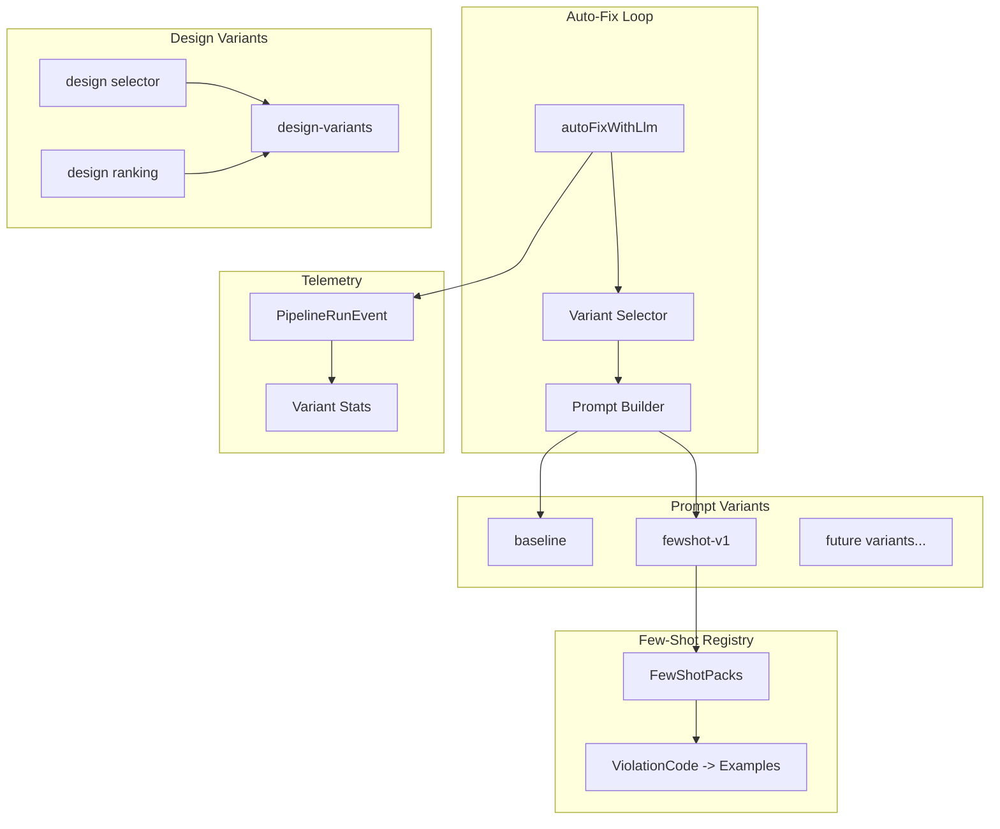

# Design Document: Prompt Tuning

## Overview

This document describes the design for a prompt tuning system that enables A/B testing of repair prompts, few-shot examples for common ViolationCodes, and risk-based repair boundaries. The system integrates with existing telemetry for measurement.

## Architecture



## Components and Interfaces

### Prompt Variant Types

```typescript
/**
 * Prompt variant identifier.
 */
type PromptVariant = 'baseline' | 'fewshot-v1' | string;

/**
 * Prompt builder function signature.
 */
type PromptBuilderFn = (
  code: string,
  errors: ValidationError[],
  filename: string,
  context?: RepairContext
) => string;

/**
 * Variant configuration.
 */
interface VariantConfig {
  id: PromptVariant;
  enabled: boolean;
  weight: number; // 0-100, for weighted selection
  builder: PromptBuilderFn;
  description: string;
}

/**
 * Variant registry.
 */
interface VariantRegistry {
  variants: Map<PromptVariant, VariantConfig>;
  defaultVariant: PromptVariant;
}
```

### Variant Selector

```typescript
/**
 * Deterministic variant selection based on hash.
 */
interface VariantSelectorOptions {
  filename: string;
  timestampBucketMs?: number; // default: 3600000 (1 hour)
  forceVariant?: PromptVariant; // for testing
}

function selectVariant(options: VariantSelectorOptions): PromptVariant;

/**
 * Hash function for deterministic selection.
 * Uses simple string hash mod enabled variants.
 */
function hashToVariant(input: string, variants: PromptVariant[]): PromptVariant;
```

### Few-Shot Pack

```typescript
/**
 * Single few-shot example.
 */
interface FewShotExample {
  violationCode: string;
  description: string;
  broken: string;  // Minimal snippet showing the error
  fixed: string;   // Minimal snippet showing the fix
}

/**
 * Few-shot pack for a category of errors.
 */
interface FewShotPack {
  category: 'syntax' | 'contract' | 'style';
  examples: FewShotExample[];
}

/**
 * Get relevant few-shot examples for given violation codes.
 */
function getFewShotExamples(
  violationCodes: string[],
  maxExamples?: number // default: 3
): FewShotExample[];
```

### Repair Boundaries

```typescript
/**
 * Boundary configuration based on risk level.
 */
interface RepairBoundary {
  riskLevel: 'low' | 'medium' | 'high';
  maxChangedLinesPercent: number;
  allowStructuralChanges: boolean;
  instructions: string[];
}

const REPAIR_BOUNDARIES: Record<string, RepairBoundary> = {
  low: {
    riskLevel: 'low',
    maxChangedLinesPercent: 50,
    allowStructuralChanges: true,
    instructions: [
      'Fix the syntax errors',
      'You may restructure code if needed',
    ],
  },
  medium: {
    riskLevel: 'medium',
    maxChangedLinesPercent: 30,
    allowStructuralChanges: false,
    instructions: [
      'Fix only the syntax errors',
      'Preserve the existing structure',
    ],
  },
  high: {
    riskLevel: 'high',
    maxChangedLinesPercent: 10,
    allowStructuralChanges: false,
    instructions: [
      'Make MINIMAL changes only',
      'Fix only the specific error locations',
      'Do NOT restructure or reformat',
      'Previous fixes were aggressive - be conservative',
    ],
  },
};
```

### Design Prompt Variants

```typescript
type DesignPromptVariant = 'editorial' | 'neo-brutal' | 'aura-glass' | string;

interface DesignVariantConfig {
  id: DesignPromptVariant;
  enabled: boolean;
  weight: number;
  stylePackId?: string;
  buildDesignCues: (context: {
    prompt: string;
    theme: string;
    seed: string;
  }) => {
    typography: string;
    layout: string;
    visualHierarchy: string;
    motion: string;
  };
  description: string;
}

interface DesignVariantRegistry {
  variants: Map<DesignPromptVariant, DesignVariantConfig>;
  defaultVariant: DesignPromptVariant;
}
```

### Design Variant Selector

```typescript
interface DesignVariantSelectorOptions {
  prompt: string;
  timestampBucketMs?: number;
  forceVariant?: DesignPromptVariant;
}

function selectDesignVariant(options: DesignVariantSelectorOptions): DesignPromptVariant;
```

### Design Variant Ranking

```typescript
interface DesignVariantCandidate {
  variant: DesignPromptVariant;
  stylePackId: string;
  designQualityScore: number;
  layoutUniquenessHash: string;
}

function pickBestDesignVariant(candidates: DesignVariantCandidate[]): DesignVariantCandidate;
```

### Extended Telemetry

```typescript
/**
 * Extended PipelineRunEvent with prompt variant.
 */
interface PipelineRunEvent {
  // ... existing fields ...
  
  // A/B testing
  promptVariant?: PromptVariant;
  repairAttempt?: number; // which attempt (1, 2, 3, fallback)

  // Design experiments
  designVariantId?: DesignPromptVariant;
  stylePackId?: string;
  designQualityScore?: number;
  layoutUniquenessHash?: string;
}

/**
 * Extended QuarantineEvent with prompt variant.
 */
interface QuarantineEvent {
  // ... existing fields ...
  
  promptVariant?: PromptVariant;
  designVariantId?: DesignPromptVariant;
}

/**
 * Per-variant statistics.
 */
interface VariantStats {
  variant: PromptVariant;
  totalRuns: number;
  successRate: number;
  avgAttempts: number;
  quarantineRate: number;
  avgRepairLatencyMs: number;
}

interface DesignVariantStats {
  variant: DesignPromptVariant;
  totalRuns: number;
  avgDesignQualityScore: number;
  uniquenessRate: number; // ratio of unique layout hashes
}

function getVariantStats(): VariantStats[];
function getDesignVariantStats(): DesignVariantStats[];
```

## Data Models

### Variant Registry Configuration

```typescript
// promptVariants.ts

export const VARIANT_REGISTRY: VariantRegistry = {
  defaultVariant: 'baseline',
  variants: new Map([
    ['baseline', {
      id: 'baseline',
      enabled: true,
      weight: 50,
      builder: buildRepairPromptV2,
      description: 'Current production prompt',
    }],
    ['fewshot-v1', {
      id: 'fewshot-v1',
      enabled: true,
      weight: 50,
      builder: buildRepairPromptWithFewShot,
      description: 'Prompt with few-shot examples for top ViolationCodes',
    }],
  ]),
};
```

### Design Variant Registry Configuration

```typescript
export const DESIGN_VARIANT_REGISTRY: DesignVariantRegistry = {
  defaultVariant: 'editorial',
  variants: new Map([
    ['editorial', {
      id: 'editorial',
      enabled: true,
      weight: 40,
      stylePackId: 'editorial-serif',
      buildDesignCues: buildEditorialCues,
      description: 'Editorial typography, balanced grid, refined whitespace',
    }],
    ['neo-brutal', {
      id: 'neo-brutal',
      enabled: true,
      weight: 30,
      stylePackId: 'neo-brutal-bold',
      buildDesignCues: buildNeoBrutalCues,
      description: 'Bold typography, heavy borders, playful asymmetry',
    }],
    ['aura-glass', {
      id: 'aura-glass',
      enabled: true,
      weight: 30,
      stylePackId: 'aura-glass',
      buildDesignCues: buildAuraGlassCues,
      description: 'Glassmorphism, luminous effects, soft gradients',
    }],
  ]),
};
```

### Few-Shot Examples Registry

```typescript
// fewShotExamples.ts

export const FEW_SHOT_EXAMPLES: FewShotExample[] = [
  // SYNTAX errors
  {
    violationCode: 'SYNTAX_UNCLOSED_TAG',
    description: 'JSX tag not properly closed',
    broken: '<div>\n  <span>text\n</div>',
    fixed: '<div>\n  <span>text</span>\n</div>',
  },
  {
    violationCode: 'SYNTAX_UNBALANCED_BRACES',
    description: 'Missing closing brace in JSX expression',
    broken: '<div>{items.map(i => <span>{i.name</span>)}</div>',
    fixed: '<div>{items.map(i => <span>{i.name}</span>)}</div>',
  },
  // CONTRACT errors
  {
    violationCode: 'CONTRACT_HERO_MISSING_H1',
    description: 'Hero section missing h1 heading',
    broken: '<section data-section="hero">\n  <p>Welcome</p>\n</section>',
    fixed: '<section data-section="hero">\n  <h1>Welcome</h1>\n</section>',
  },
  // ... more examples added based on telemetry data
];
```

## Correctness Properties

*A property is a characteristic or behavior that should hold true across all valid executions of a system.*

### Property 1: Deterministic Selection

*For any* given (filename, timestamp_bucket) pair, the Variant_Selector SHALL always return the same variant.

**Validates: Requirements 2.1, 2.3**

### Property 2: Telemetry Completeness

*For any* auto-fix run, the emitted PipelineRunEvent SHALL include the promptVariant field when auto-fix was attempted.

**Validates: Requirements 3.1, 3.2**

### Property 3: Few-Shot Relevance

*For any* set of ViolationCodes, getFewShotExamples SHALL return only examples whose violationCode matches one of the input codes.

**Validates: Requirements 4.2**

### Property 4: Boundary Enforcement

*For any* repair with riskLevel "high", the generated prompt SHALL include conservative boundary instructions.

**Validates: Requirements 5.1, 5.2**

### Property 5: Design variant determinism

*For any* given (prompt, timestamp_bucket) pair, the Design_Variant_Selector SHALL always return the same design variant.

**Validates: Requirements 8.1, 8.2**

### Property 6: Design variant ranking

*For any* set of design variant candidates, pickBestDesignVariant SHALL return the candidate with the highest designQualityScore, preferring unique layout hashes on ties.

**Validates: Requirements 9.1, 9.2**

## Error Handling

### Variant Not Found

- If requested variant doesn't exist → use defaultVariant
- Log warning for debugging

### Few-Shot Not Found

- If no matching few-shot examples → proceed without examples
- This is not an error, just less context for LLM

### Telemetry Failures

- Telemetry errors SHALL NOT affect repair execution
- Log and continue

## Testing Strategy

### Unit Tests

- Variant selector determinism
- Few-shot example filtering
- Boundary instruction generation
- Telemetry field population
- Design variant selector determinism
- Design variant ranking

### Property Tests

- Deterministic selection across many inputs
- Few-shot relevance filtering
- Boundary enforcement for all risk levels
- Design variant selector determinism
- Design variant ranking

### Integration Tests

- End-to-end A/B flow with telemetry
- Variant stats aggregation accuracy
- Design variants recorded in telemetry
