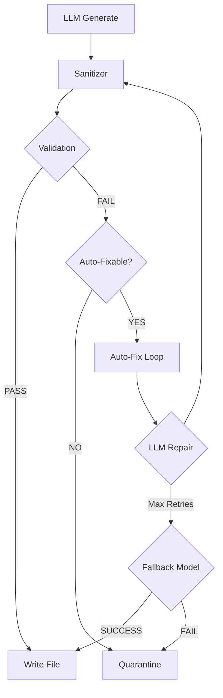

# Quality Pipeline

The Quality Pipeline ensures AI-generated code passes validation before being written to the file system.

## Architecture



## Pipeline Stages

### 1. Sanitizer (`codeSanitizer.ts`)
Deterministic regex-based fixes for common LLM errors:
- Truncated tags: `<butt>` → `<button>`
- Broken arrows: `(e) = />` → `(e) =>`
- LLM text removal (Russian/English prose)

### 2. Validation (`codeValidator.ts`)
Parses code using TypeScript compiler to detect syntax errors.

### 3. Auto-Fix Loop (`autoFixLoop.ts`)
When validation fails:
1. Build repair prompt with errors
2. Send to LLM with sentinel (`<<<END_CODE>>>`)
3. Extract code, re-sanitize, validate
4. Retry up to 3 times or fallback

## Response Contract

LLM repair uses strict contract with sentinel:
```
1. Return ONLY fixed code
2. No markdown fences
3. End with: <<<END_CODE>>>
```

**Token Limits:**
- Template selection: 1024
- Code repair: 8192

## Key Files

| File | Purpose |
|------|---------|
| `codeSanitizer.ts` | Deterministic fixes |
| `codeValidator.ts` | Syntax validation |
| `autoFixLoop.ts` | LLM repair orchestration |
| `llmRepairService.ts` | LLM API bridge |
| `api.llmcall.ts` | Token cap routing |
